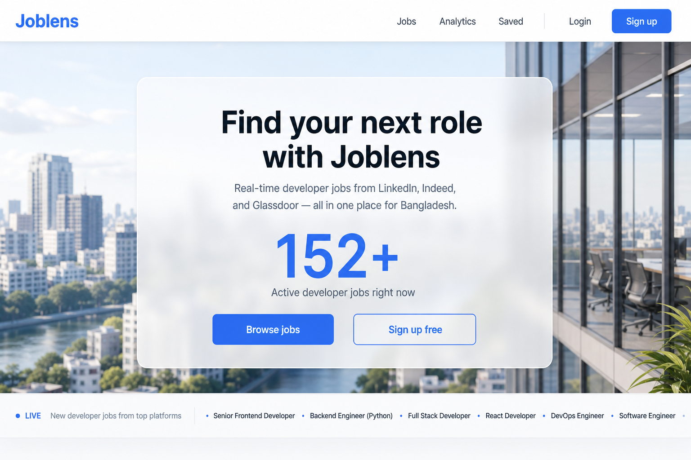

# Joblens Backend

This is the **backend** README (this folder only). Express API for Joblens — jobs ingest, auth, analytics, alerts, resume AI.

Frontend docs: `../frontend/README.md`

<p align="center">
  
</p>

<p align="center"><em>Product — landing with live job count</em></p>

<p align="center">
  
</p>

<p align="center"><em>Product — jobs board (this API feeds that UI)</em></p>

---

## What this server does

- REST API under `/api/v1` (set `API_PREFIX=api/v1` to match the frontend)
- Socket.IO: `job:new`, `stats:update`
- Ingests developer jobs from LinkedIn, Indeed, Glassdoor, Jobicy, and more
- JWT access token + httpOnly refresh cookie
- BullMQ cron: fetch jobs, analytics snapshot, alert emails, expiry
- Optional Azure OpenAI for resume customize

Layout: **route → controller → service** in `src/app/modules/`.

---

## Stack

Express 5 · TypeScript · Prisma · PostgreSQL · Redis · BullMQ · Socket.IO · Zod · JWT · Nodemailer

---

## Prerequisites

- Node.js 20+
- PostgreSQL
- Redis (local or managed)
- RapidAPI key (ingestion)
- SMTP (verify email, resets, alerts)
- Azure OpenAI (optional)

---

## Setup

```bash
cp .env.example .env
npm install
npx prisma generate
npx prisma migrate deploy
npm run dev
```

API: [http://localhost:4000/api/v1](http://localhost:4000/api/v1)  
Health: [http://localhost:4000/api/v1/health](http://localhost:4000/api/v1/health)

**Important:** set `API_PREFIX=api/v1` so it matches `NEXT_PUBLIC_API_URL` on the frontend.

On first start, a seed admin is created if missing (`SEED_ADMIN_EMAIL` / `SEED_ADMIN_PASSWORD`).

---

## Environment

Copy `.env.example`. Main groups:

| Group | Purpose |
| --- | --- |
| `DATABASE_URL` | PostgreSQL |
| `REDIS_URL` or `REDIS_HOST` / `PORT` | Cache + BullMQ |
| `JWT_*` | Access and refresh tokens |
| `FRONTEND_ORIGIN` | CORS + links in emails |
| `API_PREFIX` | Use `api/v1` |
| `JSEARCH_API_KEY` | RapidAPI — shared by all adapters |
| `SMTP_*` | Mail |
| `AZURE_OPENAI_*` | Resume AI (leave empty to skip) |
| `COOKIE_SECURE` / `COOKIE_SAMESITE` | `true` / `none` on HTTPS + split domains |

Do not commit real `.env` files.

---

## Scripts

| Command | What it does |
| --- | --- |
| `npm run dev` | Watch mode (`tsx`) |
| `npm run build` | `prisma generate` + `tsc` |
| `npm start` | Run `dist/server.js` |
| `npm run prisma:generate` | Prisma client |
| `npm run prisma:migrate` | Dev migrations |
| `npm run prisma:studio` | DB UI |
| `npm run ingestion:run` | Fetch jobs now |
| `npm run jobs:cleanup` | Purge old jobs |
| `npm run analytics:snapshot` | Daily snapshot now |
| `npm run jobs:enrich` | Enrich existing jobs |

---

## API envelope

Success: `{ "success": true, "data": ..., "meta": ... }`  
Error: `{ "success": false, "error": { "code", "message", "statusCode" } }`

Protected routes: `Authorization: Bearer <accessToken>`. Refresh: cookie `joblens_rt`.

| Area | Examples |
| --- | --- |
| Health | `GET /health` |
| Auth | `POST /auth/register` `login` `refresh` `logout` |
| Jobs | `GET /jobs` `GET /jobs/:id` `trending` `search` `similar/:id` |
| Saved | `GET /jobs/saved` `POST /jobs/save/:id` |
| Applied | `GET /jobs/applied` `POST /jobs/apply/:id` |
| Users | `GET /users/me` `PATCH /users/me/profile` |
| Alerts | `GET/POST /alerts` |
| Analytics | `GET /analytics/overview` `skills` `companies` `salaries` `locations` `timeline` `demand-index` |
| Resume | `POST /resume/upload` `POST /resume/customize/:jobId` |
| Admin | `GET /admin/stats` `POST /admin/fetch/trigger` |

---

## Scheduled jobs (Asia/Dhaka)

`src/app/modules/queue/queue.constant.ts` — workers start with the server (`src/server.ts`).

| When | What |
| --- | --- |
| 10:00, 14:00, 19:00, 23:00 | Fetch jobs |
| 00:00 | Analytics snapshot |
| 09:00 daily | Daily alert emails |
| 09:00 Monday | Weekly alert emails |
| 01:00 | Deactivate stale jobs + purge |

API process **and Redis** must stay up. Manual fetch: `npm run ingestion:run` or admin **trigger fetch**.

---

## Auth

Register → email verify → login. Login returns `{ user, accessToken }` and sets the refresh cookie. Roles: `USER`, `ADMIN`.

---

## Production

```bash
npx prisma generate
npx prisma migrate deploy
npm run build
npm start
```

- Strong JWT secrets, `NODE_ENV=production`
- `COOKIE_SECURE=true`; `COOKIE_SAMESITE=none` if UI and API are on different domains
- `FRONTEND_ORIGIN` = real site URL
- Keep one long-lived Node process (BullMQ workers run in-process)
- Postgres + Redis reachable (TLS on managed Redis)

---

## Troubleshooting

| Symptom | Check |
| --- | --- |
| Frontend cannot load jobs | `API_PREFIX`, CORS, process listening on 4000 |
| Refresh fails | Cookie `SameSite` / `Secure` / domain |
| Cron never fetches | Redis + this process running, RapidAPI quota |
| Resume customize 503 | Azure OpenAI env |
| No emails | SMTP host / port / `SMTP_SECURE` |

---

## License

ISC (`package.json`).
